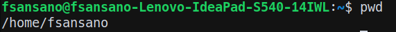
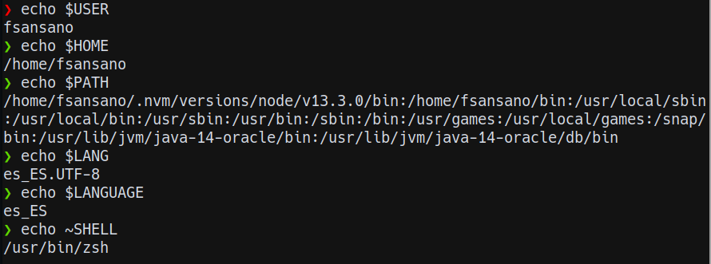

## pwd
Me dice donde estoy actualmente


## Echo
nos permite mostrar algo por pantalla.


## Cat
Puedes mirar un fichero

## Nano
Se puede editar un fichero.
Es decir, es un editor de texto.

## printf
Imprime por pantalla con formato
**nueva línea** = \n

## Cd
Cambia de directorio

## mv
Mueve ficheros y directorios.
También cambia los nombres de los ficheros y directorios

## rm y rmdir
Borra directorios y ficheros

rm -rf -----> borra forzosamente

rmdir -p ------> borra los ficheros que sean seleccionados

## mkdir
Crea un directorio
```shell
    mkdir -p dir1/{dir2/a,dir3/{b,c,d}}
```
## cp
Copia el directorio o fichero

## touch
Modifica fechas de ficheros.
También permite crear un fichero vacío, es decir, si el fichero que quieres hacer no existe, lo crea.


## tree
Muestra la estructura de un directorio.

## ls
lista el contenido de un fichero

ls -la ----> lista los ficheros ocultos con sus propiedades
ls -a ----> aparacen en una sola lína los ficheros ocultos  pero sin sus propiedades
ls -lh ----> aparecen los directorios listados con su tamaño en kb
ls -R -----> aparecen los directorios con los ficheros que hay dentro
